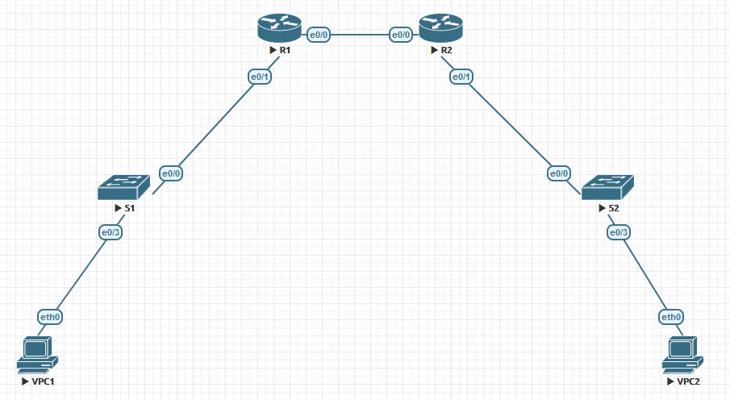

## [Задание 1](7.4.2%20Lab%20-%20Implement%20DHCPv4.docx): Настроить DHCPv4.

### Топология в EVE-NG:



### Таблица ip-адресов:
|Device|Interface|IP Address|Subnet Mask|Default Gateway|
|:-|:-|:-:|:-:|:-:|
|R1|e0/0|10.0.0.1|255.255.255.252|N/A|
||e0/1||||
||e0/1.100|192.168.1.1|255.255.255.192|N/A|
||e0/1.200|192.168.1.65|255.255.255.224|N/A|
||e0/1.1000||||
|R2|e0/0|10.0.0.2|255.255.255.252|N/A|
||e0/1|192.168.1.97|255.255.255.240|N/A|
|S1|VLAN 200|192.168.1.66|255.255.255.192|192.168.1.65|
|S2|VLAN 1|192.168.1.98|255.255.255.240|192.168.1.97|
|VPC1|NIC|DHCP|DHCP|DHCP|
|VPC2|NIC|DHCP|DHCP|DHCP|

### Таблица VLAN:
| VLAN	| Name	|Interface Assigned|
|:-|:-:|:-|
|1|N/A|S2: e0/0-3|
|100|Clients|S1: e0/3|
|200|Management|S1: VLAN 200|
|999|Parking_Lot|S1: e0/1-2|
|1000|Native|N/A|

### show running-config со всех сетевых устройств после выполнения всех заданий
[R1#sh run](R1%20sh%20run.ios)  
[R2#sh run](R2%20sh%20run.ios)  
[S1#sh run](S1%20sh%20run.ios)  
[S2#sh run](S2%20sh%20run.ios)
### Экспорт стенда в EVE-NG
[04 DHCP](_Exports_eve-ng_export-20220405-025146.zip)

## Часть 1: Создание сети и настройка основных параметров устройства

Subnet the network 192.168.1.0/24 to meet the following requirements:
1.	One subnet, “Subnet A”, supporting 58 hosts (the client VLAN at R1).  
Subnet A: 192.168.1.0/26  
Record the first IP address in the Addressing Table for R1 e0/1.100.
2.	One subnet, “Subnet B”, supporting 28 hosts (the management VLAN at R1).  
Subnet B: 192.168.1.64/27  
Record the first IP address in the Addressing Table for R1 e0/1.200. Record the second IP address in the Address Table for S1 VLAN 200 and enter the associated default gateway.
3.	One subnet, “Subnet C”, supporting 12 hosts (the client network at R2).  
Subnet C: 192.168.1.96/28  
Record the first IP address in the Addressing Table for R2 e0/1.

### Баовые настройки R1-R2:
```
enable
configure terminal
hostname R1
no ip domain-lookup
enable secret class
line console 0
exec-timeout 0 0
password cisco
login
logging synchronous
line vty 0 4
password cisco
login
logging synchronous
service password-encryption
banner motd ^
##########################################
#                                        #
#        Authorised Access Only          #
#                                        #
##########################################
^
interface ethernet 0/0
ip address 10.0.0.1 255.255.255.252
no shutdown
end
clock set 17:30:00 01 APRIL 2022
write
```
```
enable
configure terminal
hostname R2
no ip domain-lookup
enable secret class
line console 0
exec-timeout 0 0
password cisco
login
logging synchronous
line vty 0 4
password cisco
login
logging synchronous
service password-encryption
banner motd ^
##########################################
#                                        #
#        Authorised Access Only          #
#                                        #
##########################################
^
interface ethernet 0/0
ip address 10.0.0.2 255.255.255.252
no shutdown
end
clock set 17:30:00 01 APRIL 2022
write
```
### Настройка адресов саб-интерфейсов и шлюза по умолчанию на R1
```
interface ethernet 0/1
no shutdown
interface ethernet 0/1.100
encapsulation dot1Q 100
ip address 192.168.1.1 255.255.255.192
description Clients
interface ethernet 0/1.200
encapsulation dot1Q 200
ip address 192.168.1.65 255.255.255.224
description Management
interface ethernet 0/1.1000
encapsulation dot1Q 1000 native
description Native
ip route 0.0.0.0 0.0.0.0 10.0.0.2
end
write
```
### Настройки маршрутизации на R2
```
interface ethernet 0/1
ip address 192.168.1.97 255.255.255.240
no shutdown
ip route 0.0.0.0 0.0.0.0 10.0.0.1
end
write
```
#### Проверка
```
R2#ping 192.168.1.1
Type escape sequence to abort.
Sending 5, 100-byte ICMP Echos to 192.168.1.1, timeout is 2 seconds:
!!!!!
Success rate is 100 percent (5/5), round-trip min/avg/max = 1/1/2 ms
```
### Базовые настройки S1-S2
```
enable
configure terminal
hostname S1
no ip domain-lookup
enable secret class
line console 0
exec-timeout 0 0
password cisco
login
logging synchronous
line vty 0 4
password cisco
login
logging synchronous
service password-encryption
banner motd ^
##########################################
#                                        #
#        Authorised Access Only          #
#                                        #
##########################################
^
end
clock set 17:52:00 01 APRIL 2022
write
```
### Настрокйи VLAN и маршрутизации на S1-S2
#### S1
```
vlan 100
name Clients
vlan 200
name Management
vlan 999
name Parking_Lot
vlan 1000
name Native
interface Vlan200
ip address 192.168.1.66 255.255.255.192
no shutdown
ip route 0.0.0.0 0.0.0.0 192.168.1.65
interface ethernet 0/0
switchport trunk encapsulation dot1q
switchport mode trunk
switchport trunk allowed vlan 100,200,1000
switchport trunk native vlan 1000
interface Ethernet0/3
switchport mode access
switchport access vlan 100
spanning-tree portfast
interface range ethernet 0/1 - 2
switchport mode access
switchport access vlan 999
shutdown
```
#### S2
```
interface vlan 1
ip address 192.168.1.98 255.255.255.240
no shutdown
interface range ethernet 0/1 - 2
shutdown
ip route 0.0.0.0 0.0.0.0 192.168.1.97
```
### Проверка транка пингом с S2 на S1
```
S2#ping 192.168.1.66
Type escape sequence to abort.
Sending 5, 100-byte ICMP Echos to 192.168.1.66, timeout is 2 seconds:
!!!!!
Success rate is 100 percent (5/5), round-trip min/avg/max = 2/2/5 ms
```
- Q: В данный момент какие ip-адреса будут иметь компьютеры, подключённые к данной сети и использующие DHCP для назначения адресов?  
  - A: Компьютеры будут назначать адреса из диапазона 169.254.0.0/16

## Часть 2: Настройка и проверка DHCPv4 сервера на R1
### Настройка DHCP-сервера
```
ip dhcp excluded-address 192.168.1.1 192.168.1.5
ip dhcp excluded-address 192.168.1.97 192.168.1.101
ip dhcp pool R1_Client_LAN
network 192.168.1.0 /26
domain-name ccna-lab.com
default-router 192.168.1.1
lease 2 12 30
ip dhcp pool R2_Client_LAN
network 192.168.1.96 /28
domain-name ccna-lab.com
default-router 192.168.1.97
lease 2 12 30
do write
```
### Проверка DHCP-сервера
```
R1#show ip dhcp pool

Pool R1_Client_LAN :
 Utilization mark (high/low)    : 100 / 0
 Subnet size (first/next)       : 0 / 0
 Total addresses                : 62
 Leased addresses               : 0
 Pending event                  : none
 1 subnet is currently in the pool :
 Current index        IP address range                    Leased addresses
 192.168.1.1          192.168.1.1      - 192.168.1.62      0

Pool R2_Client_LAN :
 Utilization mark (high/low)    : 100 / 0
 Subnet size (first/next)       : 0 / 0
 Total addresses                : 14
 Leased addresses               : 0
 Pending event                  : none
 1 subnet is currently in the pool :
 Current index        IP address range                    Leased addresses
 192.168.1.97         192.168.1.97     - 192.168.1.110     0
```
``` 
R1#show ip dhcp binding
Bindings from all pools not associated with VRF:
IP address          Client-ID/              Lease expiration        Type
                    Hardware address/
                    User name
```
```
R1#show ip dhcp server statistics
Memory usage         25175
Address pools        2
Database agents      0
Automatic bindings   0
Manual bindings      0
Expired bindings     0
Malformed messages   0
Secure arp entries   0

Message              Received
BOOTREQUEST          0
DHCPDISCOVER         0
DHCPREQUEST          0
DHCPDECLINE          0
DHCPRELEASE          0
DHCPINFORM           0

Message              Sent
BOOTREPLY            0
DHCPOFFER            0
DHCPACK              0
DHCPNAK              0
```
### Переполучение адреса на VPC1
```
VPCS> ip dhcp -r
DDORA IP 192.168.1.6/26 GW 192.168.1.1
```
#### Проверка
```
VPCS> ping 10.0.0.2

84 bytes from 10.0.0.2 icmp_seq=1 ttl=254 time=3.271 ms
84 bytes from 10.0.0.2 icmp_seq=2 ttl=254 time=2.355 ms
84 bytes from 10.0.0.2 icmp_seq=3 ttl=254 time=2.913 ms
84 bytes from 10.0.0.2 icmp_seq=4 ttl=254 time=3.313 ms
84 bytes from 10.0.0.2 icmp_seq=5 ttl=254 time=2.587 ms
```
## Часть 3: Настройка и проверка DHCP Relay на R2

### Настройка DHCP Relay агента
```
interface ethernet 0/1
ip helper-address 10.0.0.1
do write
```
### Получение адреса на VPC2 и проверка связи с R1
```
VPCS> ip dhcp -r
DDORA IP 192.168.1.102/28 GW 192.168.1.97
```
```
VPCS> ping 10.0.0.1
84 bytes from 10.0.0.1 icmp_seq=1 ttl=254 time=3.089 ms
84 bytes from 10.0.0.1 icmp_seq=2 ttl=254 time=2.836 ms
84 bytes from 10.0.0.1 icmp_seq=3 ttl=254 time=2.580 ms
84 bytes from 10.0.0.1 icmp_seq=4 ttl=254 time=3.009 ms
84 bytes from 10.0.0.1 icmp_seq=5 ttl=254 time=2.856 ms
```
### Просмотр выданных IP-адресов на R1
```
R1#show ip dhcp binding
Bindings from all pools not associated with VRF:
IP address          Client-ID/              Lease expiration        Type
                    Hardware address/
                    User name
192.168.1.6         0100.5079.6668.05       Apr 07 2022 11:22 AM    Automatic
192.168.1.102       0100.5079.6668.06       Apr 07 2022 11:36 AM    Automatic
```

### Просмотр статистики DHСP-сервера на R1 и R2
```
R1#show ip dhcp server statistics
Memory usage         42093
Address pools        2
Database agents      0
Automatic bindings   2
Manual bindings      0
Expired bindings     0
Malformed messages   0
Secure arp entries   0

Message              Received
BOOTREQUEST          0
DHCPDISCOVER         4
DHCPREQUEST          2
DHCPDECLINE          0
DHCPRELEASE          0
DHCPINFORM           0

Message              Sent
BOOTREPLY            0
DHCPOFFER            2
DHCPACK              2
DHCPNAK              0
```
```
R2#show ip dhcp server statistics
Memory usage         30757
Address pools        0
Database agents      0
Automatic bindings   0
Manual bindings      0
Expired bindings     0
Malformed messages   0
Secure arp entries   0

Message              Received
BOOTREQUEST          0
DHCPDISCOVER         0
DHCPREQUEST          0
DHCPDECLINE          0
DHCPRELEASE          0
DHCPINFORM           0

Message              Sent
BOOTREPLY            0
DHCPOFFER            0
DHCPACK              0
DHCPNAK              0
```
## [Задание 2](8.5.1%20Lab%20-%20Configure%20DHCPv6.docx): Настроить DHCPv6.
Была использована топология и базовые настройки из Задания 1
### Таблица адресов
|Device|Interface|IPv6 Addresses|
|-|-|-|
|R1|e0/0|fe80::1, 2001:db8:acad:2::1/64|
||e0/1.100|fe80::1, 2001:db8:acad:1::1/64|
|R2|e0/0|fe80::2, 2001:db8:acad:2::2/64|
||e0/1|fe80::1, 2001:db8:acad:3::1/64|
|VPC1|NIC|DHCP|
|VPC2|NIC|DHCP|
### Включение IPv6 роутинга на роутерах и настройка адресов на интерфейсах
#### R1
```
ipv6 unicast-routing
interface ethernet 0/0
ipv6 address fe80::1 link-local
ipv6 address 2001:db8:acad:2::1/64
interface ethernet 0/1.100
ipv6 address fe80::1 link-local
ipv6 address 2001:db8:acad:1::1/64
ipv6 route ::/0 2001:db8:acad:2::2
```
#### R2
```
ipv6 unicast-routing
interface ethernet 0/0
ipv6 address fe80::2 link-local
ipv6 address 2001:db8:acad:2::2/64
interface ethernet 0/1
ipv6 address fe80::1 link-local
ipv6 address 2001:db8:acad:3::1/64
ipv6 route ::/0 2001:db8:acad:2::1
```
#### Проверка
```
R1#ping 2001:db8:acad:3::1
Type escape sequence to abort.
Sending 5, 100-byte ICMP Echos to 2001:DB8:ACAD:3::1, timeout is 2 seconds:
!!!!!
Success rate is 100 percent (5/5), round-trip min/avg/max = 1/1/1 ms
```
### Получение IPv6 GUA на VPC1 через алгоритм SLAAC
```
VPCS> ip auto
GLOBAL SCOPE      : 2001:db8:acad:1:2050:79ff:fe66:6805/64
ROUTER LINK-LAYER : aa:bb:cc:00:01:10
```
- Q: Откуда была взята хостовая часть адреса?  
  - A: Из алгоритма генерации адресов c помощью EUI-64
### Настройка и проверка DHCPv6 сервера на R1
```
ipv6 dhcp pool R1-STATELESS
dns-server 2001:db8:acad::254
domain-name STATELESS.com
interface ethernet 0/1.100
ipv6 nd other-config-flag
ipv6 dhcp server R1-STATELESS
```
#### Проверка получения настроек IPv6 на компьютере с windows  
#### (была задействована домашняя виртуалка, поскольку VPC в EVE-NG не поддерживает получение адреса по IPv6 DHCP)
```
C:\Users\Zoom
λ ipconfig /all

Настройка протокола IP для Windows

   Имя компьютера  . . . . . . . . . : WIN11-ZOOM
   Основной DNS-суффикс  . . . . . . :
   Тип узла. . . . . . . . . . . . . : Гибридный
   IP-маршрутизация включена . . . . : Нет
   WINS-прокси включен . . . . . . . : Нет
   Порядок просмотра суффиксов DNS . : STATELESS.com

Адаптер Ethernet eth0:

   DNS-суффикс подключения . . . . . : STATELESS.com
   Описание. . . . . . . . . . . . . : Intel(R) PRO/1000 MT Desktop Adapter #2
   Физический адрес. . . . . . . . . : 08-00-27-C6-27-7E
   DHCP включен. . . . . . . . . . . : Да
   Автонастройка включена. . . . . . : Да
   IPv6-адрес. . . . . . . . . . . . : 2001:db8:acad:1:78a1:9a5c:53c2:f01e(Основной)
   Временный IPv6-адрес. . . . . . . : 2001:db8:acad:1:905d:e563:7456:924a(Основной)
   Локальный IPv6-адрес канала . . . : fe80::78a1:9a5c:53c2:f01e%14(Основной)
   Автонастройка IPv4-адреса . . . . : 169.254.240.30(Основной)
   Маска подсети . . . . . . . . . . : 255.255.0.0
   Основной шлюз. . . . . . . . . : fe80::1%14
   IAID DHCPv6 . . . . . . . . . . . : 168296487
   DUID клиента DHCPv6 . . . . . . . : 00-01-00-01-29-9F-A0-26-08-00-27-C2-80-21
   DNS-серверы. . . . . . . . . . . : 2001:db8:acad::254
   NetBios через TCP/IP. . . . . . . . : Включен
   Список поиска DNS-суффиксов подключения :
                                       STATELESS.com
```
#### Проверка связи пингом e0/1 R2
```
C:\Users\Zoom
λ ping 2001:db8:acad:3::1

Обмен пакетами с 2001:db8:acad:3::1 по с 32 байтами данных:
Ответ от 2001:db8:acad:3::1: время=58мс
Ответ от 2001:db8:acad:3::1: время=60мс
Ответ от 2001:db8:acad:3::1: время=59мс
Ответ от 2001:db8:acad:3::1: время=73мс

Статистика Ping для 2001:db8:acad:3::1:
    Пакетов: отправлено = 4, получено = 4, потеряно = 0
    (0% потерь)
Приблизительное время приема-передачи в мс:
    Минимальное = 58мсек, Максимальное = 73 мсек, Среднее = 62 мсек
```
### Настройка Statefull DHCPv6 сервера на R1 для выдачи адресов в LAN R2
```
ipv6 dhcp pool R2-STATEFUL
address prefix 2001:db8:acad:3:aaa::/80
dns-server 2001:db8:acad::254
domain-name STATEFUL.com
interface ethernet 0/0
ipv6 dhcp server R2-STATEFUL
```
### Настройка и проверка DHCPv6 Relay на R2
#### Проверка SLAAC до настройки Relay
```
C:\Users\Zoom                                                                        
λ ipconfig /all                                                                      
                                                                                     
Настройка протокола IP для Windows                                                   
                                                                                     
   Имя компьютера  . . . . . . . . . : WIN-UIURJK25QRU                               
   Основной DNS-суффикс  . . . . . . :                                               
   Тип узла. . . . . . . . . . . . . : Гибридный                                     
   IP-маршрутизация включена . . . . : Нет                                           
   WINS-прокси включен . . . . . . . : Нет                                           
   Порядок просмотра суффиксов DNS . :                                           
                                                                                                                                      
Адаптер Ethernet eth0:                                                               
                                                                                     
   DNS-суффикс подключения . . . . . :                                               
   Описание. . . . . . . . . . . . . : Intel(R) PRO/1000 MT Desktop Adapter #2       
   Физический адрес. . . . . . . . . : 08-00-27-C6-27-7E                             
   DHCP включен. . . . . . . . . . . : Да                                            
   Автонастройка включена. . . . . . : Да                                            
   IPv6-адрес. . . . . . . . . . . . : 2001:db8:acad:3:78a1:9a5c:53c2:f01e(Основной) 
   Временный IPv6-адрес. . . . . . . : 2001:db8:acad:3:ac31:dd6d:601d:e3ed(Основной) 
   Локальный IPv6-адрес канала . . . : fe80::78a1:9a5c:53c2:f01e%14(Основной)        
   Основной шлюз. . . . . . . . . : fe80::1%14                                       
   IAID DHCPv6 . . . . . . . . . . . : 168296487                                     
   DUID клиента DHCPv6 . . . . . . . : 00-01-00-01-29-9F-A0-26-08-00-27-C2-80-21     
   NetBios через TCP/IP. . . . . . . . : Включен                                     
```
### Настройка Relay на R2
```
interface ethernet 0/1
ipv6 nd managed-config-flag
ipv6 dhcp relay destination 2001:db8:acad:2::1 e0/0
```
#### Проверка получения настроек на виртуалке с windows
```
C:\Users\Zoom
λ ipconfig /all

Настройка протокола IP для Windows

   Имя компьютера  . . . . . . . . . : WIN-UIURJK25QRU
   Основной DNS-суффикс  . . . . . . :
   Тип узла. . . . . . . . . . . . . : Гибридный
   IP-маршрутизация включена . . . . : Нет
   WINS-прокси включен . . . . . . . : Нет
   Порядок просмотра суффиксов DNS . : STATEFUL.com

Адаптер Ethernet eth0:

   DNS-суффикс подключения . . . . . : STATEFUL.com
   Описание. . . . . . . . . . . . . : Intel(R) PRO/1000 MT Desktop Adapter #2
   Физический адрес. . . . . . . . . : 08-00-27-C6-27-7E
   DHCP включен. . . . . . . . . . . : Да
   Автонастройка включена. . . . . . : Да
   IPv6-адрес. . . . . . . . . . . . : 2001:db8:acad:3:aaa:1460:21c6:6089(Основной)
   Аренда получена. . . . . . . . . . : 5 апреля 2022 г. 2:26:32
   Срок аренды истекает. . . . . . . . . . : 7 апреля 2022 г. 2:26:20
   IPv6-адрес. . . . . . . . . . . . : 2001:db8:acad:3:78a1:9a5c:53c2:f01e(Основной)
   Временный IPv6-адрес. . . . . . . : 2001:db8:acad:3:210a:93da:a767:6854(Основной)
   Локальный IPv6-адрес канала . . . : fe80::78a1:9a5c:53c2:f01e%14(Основной)
   Автонастройка IPv4-адреса . . . . : 169.254.240.30(Основной)
   Маска подсети . . . . . . . . . . : 255.255.0.0
   Основной шлюз. . . . . . . . . : fe80::1%14
   IAID DHCPv6 . . . . . . . . . . . : 168296487
   DUID клиента DHCPv6 . . . . . . . : 00-01-00-01-29-9F-A0-26-08-00-27-C2-80-21
   DNS-серверы. . . . . . . . . . . : 2001:db8:acad::254
   NetBios через TCP/IP. . . . . . . . : Включен
   Список поиска DNS-суффиксов подключения :
                                       STATEFUL.com
```
#### Проверка пингом до e0/1.100
```
C:\Users\Zoom
λ ping 2001:db8:acad:1::1

Обмен пакетами с 2001:db8:acad:1::1 по с 32 байтами данных:
Ответ от 2001:db8:acad:1::1: время=60мс
Ответ от 2001:db8:acad:1::1: время=60мс
Ответ от 2001:db8:acad:1::1: время=60мс
Ответ от 2001:db8:acad:1::1: время=59мс

Статистика Ping для 2001:db8:acad:1::1:
    Пакетов: отправлено = 4, получено = 4, потеряно = 0
    (0% потерь)
Приблизительное время приема-передачи в мс:
    Минимальное = 59мсек, Максимальное = 60 мсек, Среднее = 59 мсек
```
